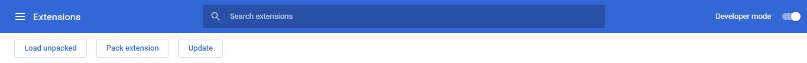
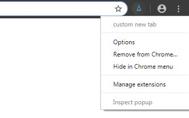
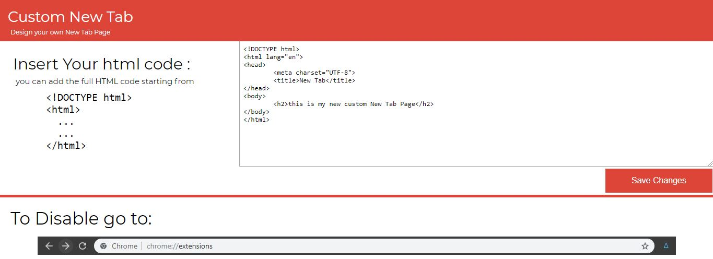

# Custom-New-Tab-Page-in-Chrome
A chrome extension to create custom New Tab Page

### To run the chrome extension locally, go to 

### Turn Developer mode ON

### choose Load Unpacked and select the folder.
---

### To place your HTML code on the New Tab, right click the icon and select options

### Now place your code in the textarea and hit save.

---
